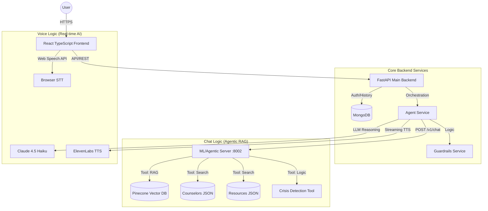

# Elevana - System Architecture (March 2026)

## 1. High-Level Overview

Elevana is a bilingual (Swahili/English) mental health platform providing specialized support through a Retrieval-Augmented Generation (RAG) chat system and a real-time conversational voice agent.

---

## 2. Component Breakdown

### 2.1 Frontend (React + TypeScript)
- **UI:** Modern, responsive interface with a focus on accessibility.
- **Voice Interface:** Animated "Voice Orb" component for interactive spoken sessions.
- **State Management:** TanStack Query for efficient server state synchronization.
- **Speech Integration:** Native Web Speech API for low-latency voice-to-text.

### 2.2 Main Backend (FastAPI)
- **API Versioning:** All endpoints under `/api/v1/`.
- **Orchestration:** Manages user sessions, chat history, and routes messages between the chat and voice agents.
- **Database:** MongoDB stores conversation logs, user preferences, and metadata.

### 2.3 ML / Agentic Server (Python/FastAPI - :8002)
A specialized server built for high-performance mental health reasoning.
- **Scikit-learn:** Used for intent classification and pattern matching.
- **Sentence-Transformers:** `all-MiniLM-L6-v2` generates 384-dimensional embeddings for semantic search.
- **Pinecone:** Cloud-native vector database storing 1,660+ bilingual Q&A pairs.

### 2.4 Voice & Conversational AI
- **LLM:** Anthropic Claude 4.5 Haiku provides empathetic, low-latency reasoning for voice sessions.
- **TTS:** ElevenLabs REST API with streaming enabled for sub-second audio response times.
- **STT Fallback:** ElevenLabs Scribe is used when browser-based STT is insufficient.

---

## 3. Data & Knowledge Base

- **Counselors Database:** A curated list of 100+ Kenyan mental health professionals with details on location, specialization, and language.
- **Resources Database:** A library of educational YouTube videos and articles categorized by mental health topics.
- **Mental Health KB:** 1,660 Q&A pairs vetted for clinical accuracy and cultural relevance in Kenya.

---

## 4. Key Workflows

### 4.1 Chat Retrieval (The "Agentic" Path)
1. Message received by Main Backend.
2. Guardrails check for off-topic or malicious content.
3. Message forwarded to ML Server.
4. ML Server detects intent (Counselor, Resource, or Chat).
5. If "Chat", Pinecone is searched with a 0.35 similarity threshold.
6. Response returned with metadata (tools used, confidence score).

### 4.2 Voice Conversation (The "Fluid" Path)
1. User speaks; Browser STT converts to text in real-time.
2. Text sent to Voice Agent (Claude Haiku).
3. System prompt ensures response is short, empathetic, and markdown-free.
4. Text sent to ElevenLabs; audio chunks stream back to Frontend immediately.
5. Frontend plays audio as it arrives (Chunked Transfer Encoding).

---
*Last Updated: March 2026*
